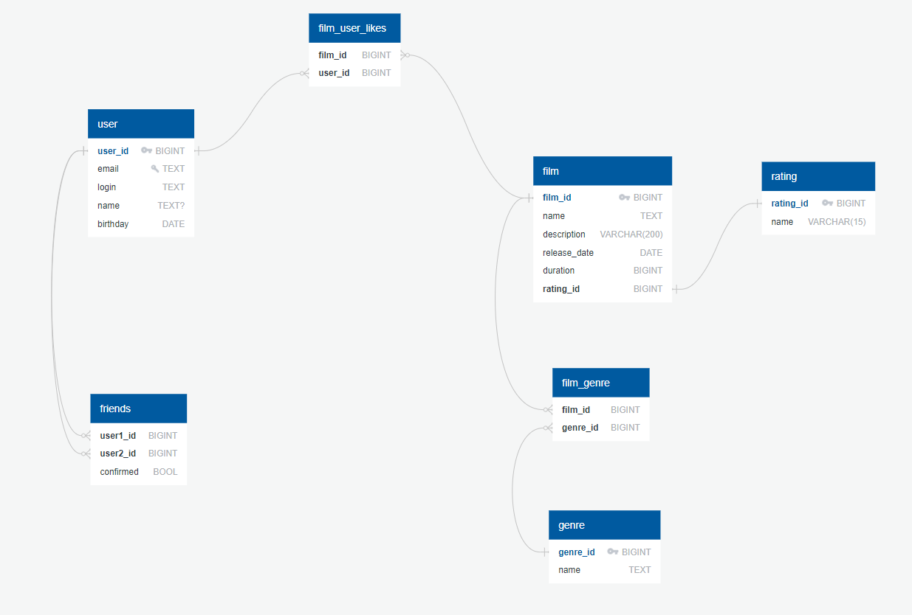

# java-filmorate
Template repository for Filmorate project.
Ссылка на ER-диаграмму схемы https://app.quickdatabasediagrams.com/#/d/pRqAbJ


Для получения имени топ-10 фильмов по количеству лайков:
```postgresql
SELECT f.name,
       COUNT(ful.user_id)
FROM film f
LEFT JOIN film_user_likes ful ON f.film_id = ful.film_id
GROUP BY f.name;
```

Имена друзей пользователя с ID = 17.
```postgresql
SELECT u.name
FROM user u
JOIN friends f ON (u.user_id = f.user1_id) OR (u.user_id = f.user2_id)
WHERE (u.user_id = f.user1_id AND f.user1_id = 17 AND f.confirmed = true)
OR (u.user_id = f.user2_id AND f.user2_id = 17 AND f.confirmed = true)
```

Общие друзья пользователей с ID = 44 и ID = 17.
```postgresql
SELECT *
FROM user u
         JOIN friends f ON (u.user_id = f.user1_id) OR (u.user_id = f.user2_id)
WHERE (u.user_id = f.user1_id AND f.user1_id = 44 AND f.confirmed = true)
   OR (u.user_id = f.user2_id AND f.user2_id = 44 AND f.confirmed = true)
UNION
SELECT *
FROM user u
         JOIN friends f ON (u.user_id = f.user1_id) OR (u.user_id = f.user2_id)
WHERE (u.user_id = f.user1_id AND f.user1_id = 17 AND f.confirmed = true)
   OR (u.user_id = f.user2_id AND f.user2_id = 17 AND f.confirmed = true)
```
> [!IMPORTANT]
> <br> 
> ID пользователя отправивший запрос на дружбу другому пользователю будет записано с поле user1_id в таблице friends
> <br>
> А ID пользователя кому был отправлен запрос в колонке user2_id
> <br>

> [!WARNING]
> <br> 
> Таблица friends содержит поля user1_id и user2_id и поиск проводиться но обеим полям. Ведь сразу не понятно где может оказаться ID пользователя
> <br>